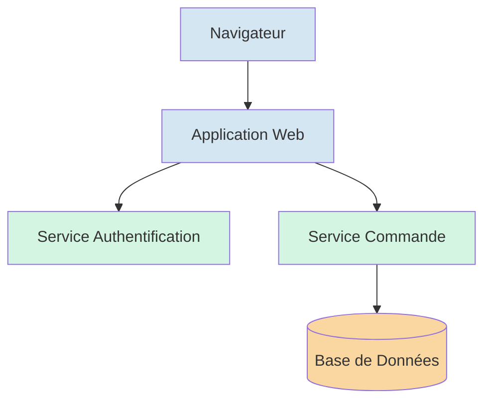
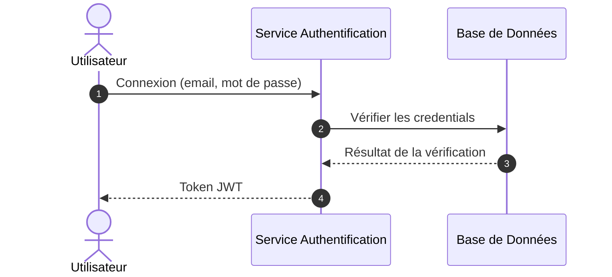
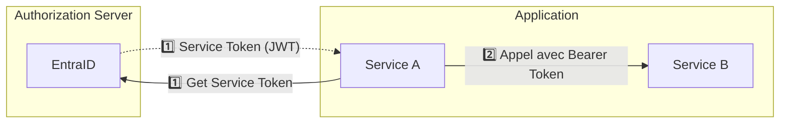
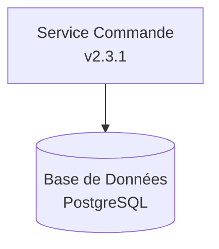
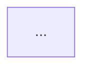
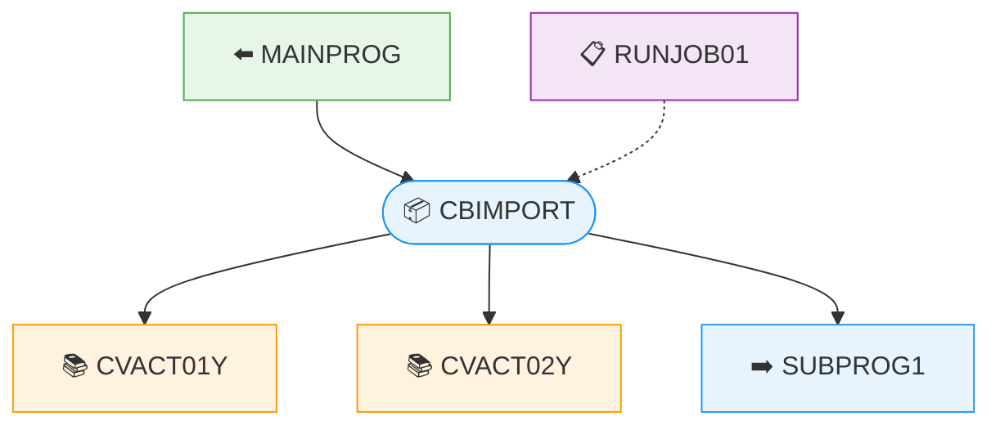
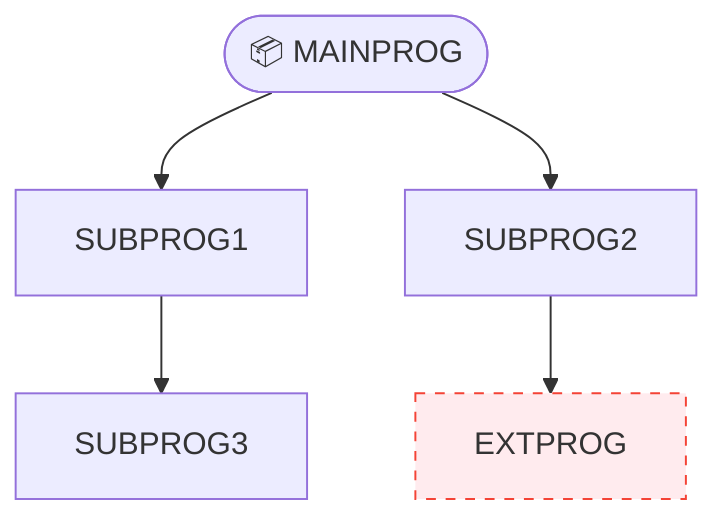
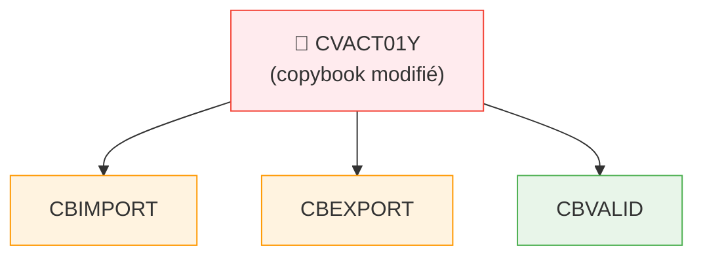

## Comportement général

**À chaque utilisation de ce skill, commencer la réponse par :**
> *"J'utilise le skill **mermaid-editor** pour générer ce diagramme."*

Tu génères des diagrammes Mermaid en respectant **toujours** les conventions
définies dans ce skill. Ces règles s'appliquent à tous les types de diagrammes.

---

## Règles obligatoires

### 1. Noms de variables significatifs
- Les identifiants de noeuds et de participants doivent **toujours** refléter
  leur rôle réel dans le système.
- ❌ `A`, `B`, `node1`, `p1`
- ✅ `utilisateur`, `serviceAuthentification`, `baseDeDonnees`

### 2. Utilisation des couleurs
- Les couleurs servent **uniquement** à regrouper des éléments qui ont le
  **même rôle fonctionnel**.
- Ne jamais utiliser les couleurs à des fins purement esthétiques.
- Exemple de regroupements valides :
  - Tous les services externes → même couleur
  - Tous les composants front-end → même couleur
  - Tous les composants back-end → même couleur



### 3. Diagrammes de séquence : toujours utiliser `autonumber`
- Tous les diagrammes de séquence doivent inclure la directive `autonumber`
  pour numéroter automatiquement les étapes.
- Cela facilite les références lors des discussions et des revues.



### 4. Ordre des actions dans un flowchart

Quand un `flowchart` représente une séquence d'événements ordonnés, utiliser les **emoji keycap** (1️⃣2️⃣3️⃣…) en préfixe sur les labels de flèches pour indiquer l'ordre.

- ✅ Préférer les keycap emoji plutôt que les chiffres cerclés Unicode (①②③) — ils sont nettement plus grands et lisibles dans le rendu.
- Ne pas ajouter d'autres emoji décoratifs sur les flèches ou les nœuds — ils surchargent le diagramme sans valeur ajoutée.
- Quand le même numéro s'applique à l'aller et au retour d'un échange (ex : demande + réponse), utiliser le même chiffre sur les deux flèches.



### 5. Texte sur plusieurs lignes dans un nœud
- Pour afficher du texte sur plusieurs lignes dans un nœud, utiliser `<br>`.
- ❌ `\n` (ne fonctionne pas dans Mermaid)
- ✅ `<br>` (balise HTML reconnue par le moteur de rendu Mermaid)

> **🚫 INTERDIT — zéro tolérance** : La séquence `\n` est **strictement interdite** dans tout label de nœud, d'arête ou de participant Mermaid. Toute occurrence de `\n` dans le code généré est considérée comme une **erreur bloquante** à corriger avant livraison.



---

## Validation pré-livraison (obligatoire)

Avant de soumettre tout diagramme généré, effectuer mentalement ces vérifications dans l'ordre :

1. **Aucun `\n`** — scanner chaque label de nœud, d'arête et de participant : toute présence de `\n` doit être remplacée par `<br>` (règle 5).
2. **`autonumber` présent** — vérifier que tout `sequenceDiagram` contient la directive `autonumber` (règle 3).
3. **Identifiants significatifs** — aucun identifiant de type `A`, `B`, `node1` (règle 1).
4. **Couleurs par rôle** — vérifier que les `classDef` regroupent uniquement des éléments de même rôle fonctionnel (règle 2).
5. **Ordre dans les flowcharts** — si le diagramme représente une séquence d'événements, vérifier que les keycap emoji sont présents sur les flèches (règle 4).

Si l'une de ces vérifications échoue, **corriger avant de répondre**.

---

## Structure de réponse

Toujours retourner le diagramme dans un bloc de code Mermaid :



---

## Rappel des types de diagrammes supportés

| Type | Directive | Règle spéciale |
|---|---|---|
| Flowchart | `graph TD` | Couleurs par rôle fonctionnel |
| Séquence | `sequenceDiagram` | Toujours `autonumber` |
| Classes | `classDiagram` | Noms de classes significatifs |
| État | `stateDiagram-v2` | Couleurs par type d'état |

---

## Diagrammes COBOL (Cobologic)

Quand un skill Cobologic produit des résultats de dépendances, chaîne d'appels
ou analyse d'impact, **toujours générer un diagramme Mermaid** via
`renderMermaidDiagram` en plus de la sortie textuelle.

### Correspondance skill → diagramme

| Skill | Type | Direction | Description |
|---|---|---|---|
| `analyze-dependencies` | `graph TD` | Programme au centre | Copybooks, callees, callers et JCL autour du programme |
| `analyze-call-chain` | `graph TD` | Top-down | Arbre d'appels récursif |
| `analyze-impact` | `graph TD` | Source → cibles | Élément modifié → éléments impactés |
| `find-copybook-usage` | `graph LR` | Gauche → droite | Copybook → programmes qui l'utilisent |
| `find-programs-using-dataset` | `graph LR` | Gauche → droite | Dataset → programmes |
| `compare-programs` | `graph TD` | Deux racines | Deux programmes avec dépendances partagées mises en évidence |

### classDef COBOL obligatoires

Utiliser systématiquement ces classes pour distinguer les types d'entités :

```
classDef default fill:#e8f4fd,stroke:#2196F3
classDef copybook fill:#fff3e0,stroke:#FF9800
classDef caller fill:#e8f5e9,stroke:#4CAF50
classDef jcl fill:#f3e5f5,stroke:#9C27B0
classDef external fill:#ffebee,stroke:#f44336,stroke-dasharray: 5 5
classDef circular fill:#fff9c4,stroke:#FFC107,stroke-dasharray: 3 3
```

### Règles spécifiques COBOL

- Marquer les programmes externes (non trouvés dans le catalogue) avec `:::external`
- Marquer les dépendances circulaires avec `:::circular`
- Garder les labels courts : nom du programme uniquement, pas de chemin
- Pour les chaînes d'appels > 3 niveaux, regrouper les feuilles dans un nœud résumé
- Utiliser des liens pointillés (`-.->`) pour les relations JCL → Programme

### Exemple : analyze-dependencies



### Exemple : analyze-call-chain



### Exemple : analyze-impact

